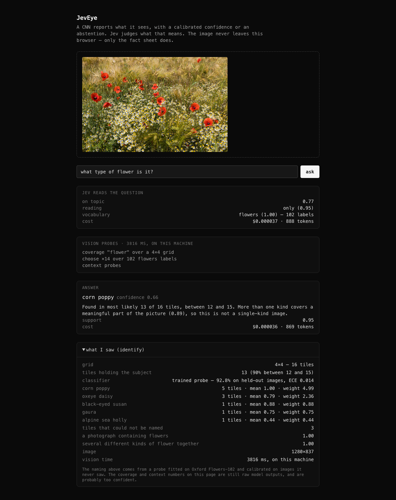
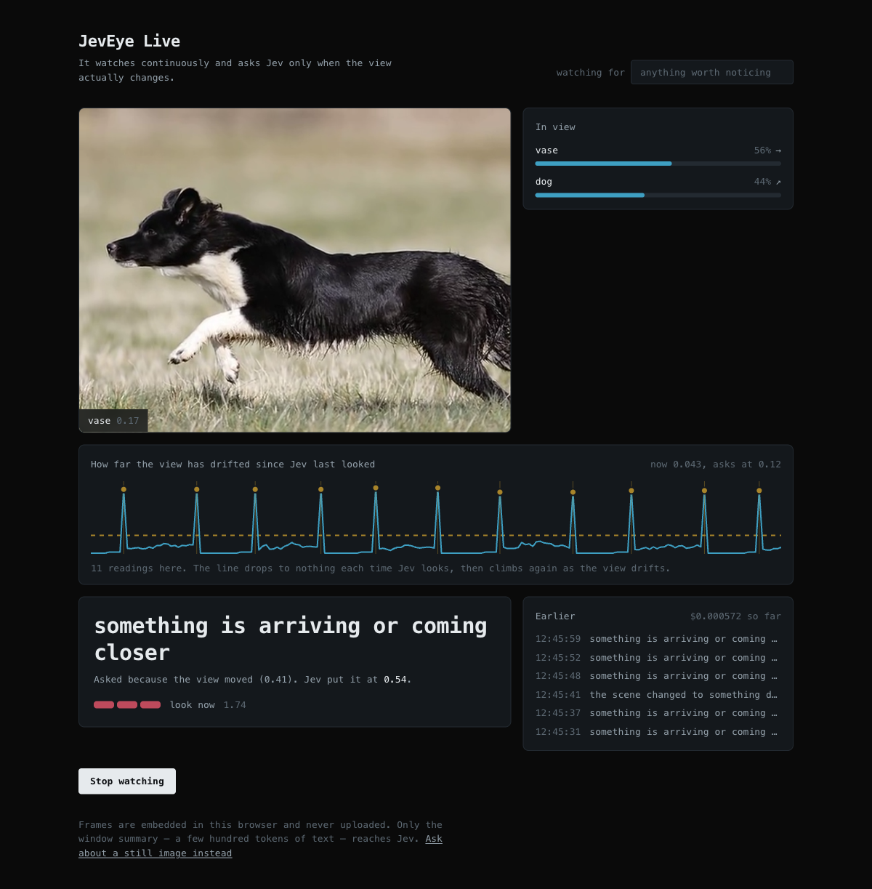

# JevEye

**A CNN reports what it sees, with a calibrated confidence or an abstention. Jev judges what that means.**

<p align="center">
  
  <br><sub>Photograph by JackyM59, <a href="https://creativecommons.org/licenses/by-sa/4.0">CC BY-SA 4.0</a>, via Wikimedia Commons. See <a href="fixtures/README.md">fixtures</a>.</sub>
</p>

[Jev](https://docs.typesafe.ai) accepts text only — *"State must be a string, JSON object, or array of text values. Images, audio, and video are not supported (yet)."* JevEye is the layer that lets you ask it about a photograph anyway, without pretending the model can see.

Two layers, strict boundary:

- **The vision layer** answers only questions of fact. What is here and where; is this a flower; which of these 102 species; how much of the picture holds one. Every answer carries a probability, or abstains. It never judges.
- **Jev** judges. It reads the facts as text, with every confidence still attached — `corn poppy: 3 tiles, mean 0.32, weight 0.96` — and draws the conclusion. It never sees pixels.

The loop closes because Jev decides *what to look for*. Before a single pixel is touched it reads your question into one of six **readings**, and the reading chooses which probes run:

| You ask | Reading | What actually runs |
|---|---|---|
| "what type of flower is it?" | `only` | coverage, then the classifier over tiles |
| "which flowers are in this field?" | `every` | same, judged for multiplicity |
| "is there a dog in this photo?" | `presence` | Jev picks `dog` from the label set; one open-vocabulary sentence is scored |
| "how much is covered in flowers?" | `count` | coverage only — the classifier never runs |
| "do these plants look healthy?" | `rating` | an ordered scale; no label set involved at all |
| "is this photo blurry?" | `rating` | the `sharpness` scale |

Two of those paths never touch the 182 labels. `detect` and `score` take **arbitrary sentences**, so presence and rating are open-vocabulary — the closed set only constrains *naming*.

```text
drop field.jpg  +  "what type of flower is it?"

JEV READS THE QUESTION                            $0.000024
  on topic      0.77
  vocabulary    flowers (1.00) — 102 labels
  reading       only (0.96)

VISION PROBES                            4.9 s, in the browser
  coverage "flower" over a 4×4 grid
  choose ×14 over 102 flowers labels

WHAT IT SAW
  tiles holding the subject   14 of 16 (90% between 12 and 15)
  corn poppy                  3 tiles · mean 0.32 · weight 0.96
  ball moss                   1 tiles · mean 0.20 · weight 0.20
  mexican aster               1 tiles · mean 0.14 · weight 0.14
  common dandelion            1 tiles · mean 0.12 · weight 0.12
  could not be named          8 tiles

JEV JUDGES                                        $0.000035
  corn poppy    confidence 0.37    support 0.88    mixed 0.71

  "Found in most likely 14 of 16 tiles. More than one kind covers a
   meaningful part of the picture (0.71), so this is not a single-kind image."
```

Why this is not just a VLM with extra steps: a VLM collapses seeing and judging into one opaque pass, and its confidence is about tokens rather than about the world. Here the seeing and the judging are separate, each reports its own uncertainty, and the fact sheet between them is readable — you can see what it thought it saw before it concluded anything.

## JevEye Live

<p align="center">
  
</p>

`/live` watches a video feed instead of a still image — your camera, a video file you drop on it, or the sample clip. Files are read locally like everything else here; nothing is uploaded. Perception and judgment run at different speeds, and the gap between them is the design:

| | measured |
|---|---|
| Embedding one frame | ~15 ms |
| A Jev round trip | ~1.1 s median (395–1553 ms) |

Seventy times apart, so Jev cannot sit in the frame loop. Instead frames are embedded continuously and **the embeddings themselves are the gate**: consecutive frames are unit vectors, so their cosine distance says how much the view moved. No motion estimation, no second model, no threshold tuned against pixels. Jev is asked only when the view moves past 0.12, when the leading label changes, or on a 20-second heartbeat — and never more than once every 2.5 s, since a call takes 1.1.

This is the JevNQL shape moved from rows to time: a cheap deterministic filter upstream, the expensive semantic judgment only on what survives.

The interface is built around that gate rather than around the video. Drift climbs while the view changes and drops to nothing each time Jev looks, so the trace draws a sawtooth — the mechanism itself, not an illustration of it, with a marker at every reading. No bounding boxes are drawn, because whole frames are classified and there are none to draw; the overlay names the current frame and says so.

What Jev gets is a **window**, not a frame:

```text
the last 8.8 seconds, sampled 30 times at 3.4 per second
  dog    led in 57% of samples, mean 0.47, rising across the window,
         last seen 0.0s ago
  vase   led in 33% of samples, mean 0.17, falling, last seen 6.0s ago
  nothing nameable in 3 of 30 samples
  the view moved 0.42 since you last looked

→ "something is arriving or coming closer" · confidence 0.55
  attention 1.70 · settled 0.19 · $0.000034
```

That is the point of using a semantic model here at all. A per-frame classifier can say a dog is present; only the window says it is **rising** — which is what "coming closer" means. Same shape as *"seem increasingly dissatisfied"* in JevNQL: a trend judged over a history rather than a value read off one row.

Forty seconds of the sample clip cost **$0.000235** across 7 judgments. A still scene costs nothing at all, which is asserted in `src/lib/live.test.ts` rather than claimed.

Known limits, on top of everything below:

- **Live names things with the detector, so it is bound to COCO's 80 categories.** A still-image question lets Jev pick the label set; a camera has no question. Point it at flowers and the detector finds nothing and CLIP takes over, at which point it reaches for "vase". Letting the "watching for" text pick the vocabulary is the fix worth making.

  Two earlier attempts are worth recording. Whole-frame classification reported "frisbee" and "chair" on a dog agility run and could not name 17 of 30 samples. Sampling the frame's quarters and keeping the most confident of the five cut that to 1 in 19 and made the naming *worse* — "sports ball" at 0.53 — because picking the best of five inflates confidence by selection alone. Neither was a vocabulary problem or a sampling problem: the missing piece was localisation, which is what the detector supplies.
- **Whole frames only.** No tiling, so there is no coverage or spatial detail per frame; the grid would cost 16 embeddings per sample.
- **No model of action.** CLIP reads single frames. "Rising confidence" approximates approach; falling over, reaching, handing something across would need a temporal encoder.
- **It cannot do reflexes.** At ~1.1 s, nothing that needs a sub-second response should route through Jev. This is the slow, interpretive loop.

## Run it

Needs Node 20+ and a [TypeSafe](https://typesafe.ai) API key.

```bash
npm install
echo "TYPESAFE_API_KEY=your-key" > .env.local
npm run dev
```

Deploying: one Vercel project, `TYPESAFE_API_KEY` set as an environment variable. Nothing else to host — the models run in the visitor's browser.

```bash
vercel deploy
```

## How it works

| Layer | Where | What |
|---|---|---|
| DETR with a ResNet-50 backbone, q8 ONNX (41 MB) | the browser, loaded on demand | `detectObjects` — what is here, and where |
| CLIP ViT-B/32, q8 ONNX (145 MB) | the browser, via transformers.js on WebGPU (WASM fallback) | `detect`, `choose`, `score`, `coverage` |
| Jev, via `@typesafe-ai/sdk` | `/api/plan`, `/api/judge` | picks the reading, label set, subject and scale; judges the fact sheet |

Each reading produces a differently shaped fact sheet, and each gets its own question of Jev — naming is a `choice`, presence is a `noul`, rating is a `score`. The one constant is that Jev is always told how thin the evidence was, which is why a "no" can come back at 0.66 with support 0.30.

**The image never leaves the browser.** Only the fact sheet — a few hundred bytes of JSON — crosses the network. The API key is the reason a server exists at all.

**First visit downloads about 145 MB** of q8 CLIP weights — the vision tower (84 MB) and the text tower (61 MB) — cached by the browser thereafter. The two towers load separately rather than through a pipeline, so an image's 512-d embedding is available directly: that is what lets a trained probe and the zero-shot classifier share one forward pass, and it lets text embeddings be cached instead of recomputed every call.

Zero-shot label scoring now ensembles six prompt templates rather than using one, which is the CLIP paper's own recipe: any single phrasing is as much a quirk of wording as a description. The embeddings are averaged once and cached, so the extra templates cost nothing after warm-up. The probe path is unaffected — it reads embeddings directly.

Nothing in the vision layer is new. CLIP is
[OpenAI's](https://arxiv.org/abs/2103.00020) (Radford et al., 2021), used as released, via
[Xenova's ONNX export](https://huggingface.co/Xenova/clip-vit-base-patch32) and
[transformers.js](https://github.com/huggingface/transformers.js). The
`"a photo of a {}"` prompt template is that paper's own zero-shot recipe.
[Temperature scaling and ECE](https://arxiv.org/abs/1706.04599) are Guo et al., 2017;
abstaining below a threshold is [Chow's reject option](https://doi.org/10.1109/TIT.1970.1054406), 1970.
What is JevEye's own is the arrangement: the strict split between scoring facts and judging them,
Jev choosing the probes before any pixel is read, the chance-relative abstention rule, and routing
tile presences through a Poisson-binomial so counts arrive as intervals.

Label sets **and rating scales** are shipped, never generated — Jev picks which one applies, exactly as it picks a vocabulary: [Oxford Flowers-102](https://www.robots.ox.ac.uk/~vgg/data/flowers/102/) and the 80 COCO categories. Jev picks which one a question is about. Nothing in this system generates text.

## What it does not do

Stated plainly, because the whole point is honest uncertainty.

- **Only flower naming is calibrated.** The probe below is fitted and measured; everything else — `detect`, `score`, `coverage`, and naming in any vocabulary without a probe — still ships identity temperatures, so those confidences are raw model outputs and are very likely too high. `detect` in particular returns 1.00 far too readily. The 12× chance abstention bar was picked by eye against one photograph, which is not validation.
- **Counting only works for the detector's 80 categories.** Ask how many dogs and it localises them and reports a count with an interval. Ask how many flowers and it falls back to tile coverage, which measures how much of the picture they fill rather than how many there are — the answer says so.
- **Detection costs a second.** DETR is accurate and slow; a still question that consults it takes several seconds in WASM, and the live view runs it on every fourth frame for that reason.
- **The grid is coarse.** A flower straddling two tiles is seen twice; one much smaller than a tile is diluted by its background.
- **`compare` is not implemented.** Two-image questions ("is this the same plant?") are designed but not built.
- **Rating uses five shipped scales** — health, sharpness, crowding, damage, lighting. Ask along a scale that isn't there and it falls back to naming, because Jev cannot write a new scale.
- **`detect` is weak at proving an absence.** CLIP scores any concrete sentence far above a vague one, so a statement contrasted only against "something else entirely" wins on almost any photograph. It now competes against an explicit negation, which helps but does not cure it. Presence questions therefore go through the vocabulary instead, where 80 real alternatives compete — and an absence shows up as the subject placing 13th behind a dog.
- **Out-of-vocabulary is the real hazard.** Show it a protea and CLIP will reach for the nearest of its 102 labels. The margin-and-chance abstention rule is what keeps that from becoming a confident lie, and it is exactly the part that fitting would make trustworthy.
- **Domain drift.** The label sets and thresholds suit web-like photographs. Satellite, medical, document and screenshot images will be wrong in ways the confidences will not warn you about.

## The detector

For a long time this project had no way to answer *where*, because OWL-ViT would not load in the browser at any usable quantization. Everything was whole-image classification, and that breaks in a specific, predictable way: a dog occupying a twentieth of a field is not what the field is "a photo of". Asked what a photograph of a dog showed, CLIP's whole-image ranking put **frisbee at 0.471** ahead of **dog at 0.349**.

DETR with a ResNet-50 backbone does load, and it is an actual convolutional detector — which makes the line at the top of this page literally true for the first time, since CLIP's ViT is a transformer. On the same photograph it returns **dog at 1.00, covering 47% of the frame**, and localises no airplane at all.

Because it returns coordinates, the picture can finally be marked up honestly: boxes are drawn only where a detector put them, never on the classifier paths, which have no boxes and would be inventing them. The outlines toggle off, and so do the numbers — a visitor sees an answer in plain words first, and the measurements only if they ask.

It changes three answers:

| | before | after |
|---|---|---|
| "what is this?" on a dog | *frisbee* | **dog, 0.86** |
| "can this fly?" on a dog | no — 0.66, support 0.30 | **no — 0.94, support 1.61** |
| live on a dog agility run | *frisbee 37%*, *chair 7%*, 17 of 30 frames unnameable | **dog 67%, person 33%**, none unnameable |

Counting is real again, too. `count` asks the detector for instances and runs the Poisson-binomial over its per-box confidences, so "how many dogs" returns a number and an interval rather than a count of tiles. When the subject is outside its 80 categories the tile coverage is still reported — and the answer says which of the two it is, because they are different claims.

### Tracking

A detector answers "what is in this frame" and nothing else. Run it twice and you get two unrelated lists, which is why boxes jump: nothing claims that this dog is the same dog as a moment ago. `src/lib/track.ts` adds that claim, by the standard method — associate by overlap, carry a velocity, predict between observations, retire what stops being seen. No Kalman filter; a constant-velocity estimate with exponential smoothing behaves almost the same at these rates and is far easier to reason about when a result looks wrong.

That buys three things a per-frame detector cannot give:

- **Identity.** `dog #379` stays `dog #379` across frames, so "how long has this been here" has an answer.
- **Motion between passes.** Boxes are redrawn every 60 ms along each track's own velocity, so a subject is followed rather than teleported once a second.
- **Direction and depth.** A box whose area is growing is approaching, whatever its centre does. "coming closer" is measured, not guessed.

Detection resolution turned out to dominate cost. DETR's config asks for an 800px shortest edge and upscales anything smaller to reach it; measured on one photograph, median of three after warm-up:

| shortest edge | median | detections |
|---|---|---|
| 800 px | 6561 ms | 1 |
| 560 px | 1885 ms | 1 |
| 480 px | 1200 ms | 1 |
| **400 px** | **660 ms** | 1 |

Ten times faster, same dog. Live runs at 400, stills at 560 where a little more care costs nothing.

In the live view the detector runs every second sample rather than every one: embedding a frame costs ~15 ms and detection closer to a second, so drift is measured continuously while naming reuses its last answer in between. What is in shot changes far more slowly than the view does.

## The trained probe

Naming flowers used to be zero-shot: score the image against 102 sentences and take the best. That is weak on fine-grained species, so there is now a linear probe — a logistic regression on CLIP's frozen 512-d embeddings, fitted on Oxford Flowers-102's own train+val split, with a temperature fitted separately on held-out images so the confidence means something.

Measured on 1,500 test images that neither the probe nor the temperature ever saw:

| | zero-shot | trained probe |
|---|---|---|
| **Accuracy** | 29.1% | **92.8%** |
| **ECE, raw** | 0.093 | 0.459 |
| **ECE, calibrated** | 0.041 | **0.014** |

Chance is 1.0%. The full report is in [`docs/probe-report.json`](docs/probe-report.json).

Three things worth saying plainly about those numbers:

- **Zero-shot at 29% is well below the ~66% the CLIP paper reports** for this dataset. The gap is ours, not theirs: q8 quantization costs accuracy, and the paper ensembles 80 prompt templates where JevEye uses one. It is the honest baseline *for this build*, which is what the probe had to beat.
- **The raw probe is badly calibrated in the opposite direction** — ECE 0.459 while being right 92.8% of the time, i.e. far too *timid*. The fitted temperature of 0.35 sharpens it. Calibration is not only about reining models in.
- **On the demo photograph the difference is visible**, and not just as a bigger number. Zero-shot found corn poppy in 3 tiles at mean 0.32 alongside junk labels — ball moss, silverbush — and could not name 8 of 14 tiles. The probe finds corn poppy in 5 tiles at mean 1.00 and correctly names the white flowers *oxeye daisy*, the nearest species in the vocabulary to the scentless mayweed actually present. Jev's mixed-picture probability rises from 0.71 to 0.89, because for the first time the second species is actually in the evidence.

Nothing about CLIP changed. The encoder is frozen; 204 KB of fitted weights sit on top, which is why this costs nothing at load time.

**To refit, or to fit a probe for another vocabulary:**

```bash
python3 tools/prepare.py <workdir>          # splits: train / calibrate / test, kept disjoint
node    tools/embed.mjs <split>.json <split>.bin   # CLIP embeddings, same q8 weights the browser loads
node    tools/embed-text.mjs flowers text.bin      # the zero-shot baseline to beat
python3 tools/fit.py <workdir> public/probes       # probe + temperature + the report above
```

The embedder deliberately uses the same checkpoint and quantization as the browser: a probe fitted on fp32 embeddings and served against q8 ones is a train/serve skew you cannot see and cannot debug.

## Evaluations

```bash
npm run eval            # includes the planner, which calls Jev (~$0.0013)
npm run eval:offline    # everything that needs no network
```

Unit tests say the code does what it was written to do. These say the system is as good as this page claims, which is a different question and the one that quietly stops being true.

**Tracking** runs synthetic sequences whose ground truth is known by construction — a subject crossing the frame, one the detector loses for three passes, noisy boxes, and two of the same kind crossing paths. Real MOT benchmarks are gigabytes and licensed; these cover the failures that actually break trackers. The headline number is identity switches, because a tracker that relabels a subject halfway across the frame has failed at the one job detection cannot do.

| scenario | id switches | covered | phantom boxes |
|---|---|---|---|
| one subject crossing the frame | 0 | 95% | 0 |
| detector loses it for three passes | 0 | 80% | 0 |
| noisy boxes around a steady subject | 0 | 95% | 0 |
| **two of the same kind crossing paths** | **2** | 95% | 1 |

That last row is the honest limit: greedy overlap association swaps identities when two same-label objects cross. Fixing it needs appearance features per track, not better bookkeeping.

**How Jev reads questions** runs 24 fixed cases through the real planner, because it is the one component whose behaviour changes without the code changing. Where more than one reading is defensible the case accepts a set — "what kind of flower is this" is legitimately `only` or `dominant`, and scoring it as a single right answer would measure the rubric rather than the model.

| | |
|---|---|
| refused off-topic questions correctly | 24/24 |
| chose the right reading | 20/20 |
| chose the right catalogue | 12/12 |
| chose the right subject | 9/9 |
| chose the right scale | 6/6 |

It earned its keep on the first run, which scored 19/20 and 5/6: *"was this taken in the dark?"* read as `presence` rather than `rating`, because "in the dark" sounds like something to look for rather than a scale to measure along. The two readings are now described by what they ask about — a thing you could point at, against a quality something has — and yes-or-no phrasing is called out as belonging to a rating when the subject is a quality. That is a change to a sentence Jev reads, verified by re-running the suite.

**The shipped probe** is checked against the accuracy and calibration it advertises, so a refit cannot quietly make the downloaded weights worse.

## Tests

```bash
npm test
```

Covers the calibration arithmetic: temperature scaling, the Poisson-binomial over tile presences, the interval that widens on marginal evidence, and the chance-relative abstention rule. The model path is not unit-tested; it was verified end to end in a browser. The probe's accuracy and ECE come from `tools/fit.py` on a held-out split, not from a test.

## Layout

```text
src/lib/calibration.ts   temperatures, abstention rules, Poisson-binomial
src/lib/vision.ts        the primitives and the fact sheet, browser-side
src/lib/vocab/           shipped label sets
src/lib/scales.ts        shipped rating scales
public/probes/           fitted probe weights (204 KB) and its measured quality
tools/                   offline: embed, fit the probe, fit the temperature
src/app/api/plan/        Jev reads the question
src/app/api/judge/       Jev judges the fact sheet
src/app/page.tsx         drop zone, chat bar, answer, fact sheet
```

Sibling project to [JevNQL](https://github.com/Adityakhalkar/JevNQL), which does the same trick for tabular data: send the arithmetic to a relational engine, send only the judgments to Jev.

MIT.
